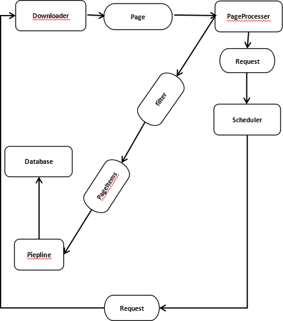
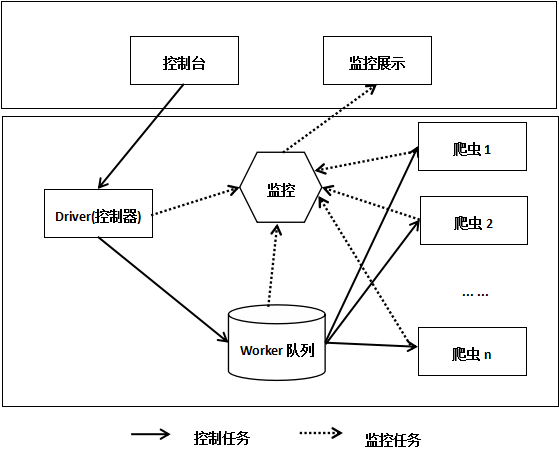
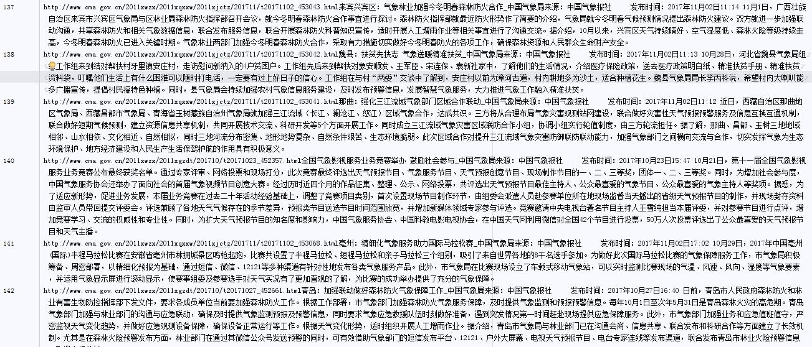
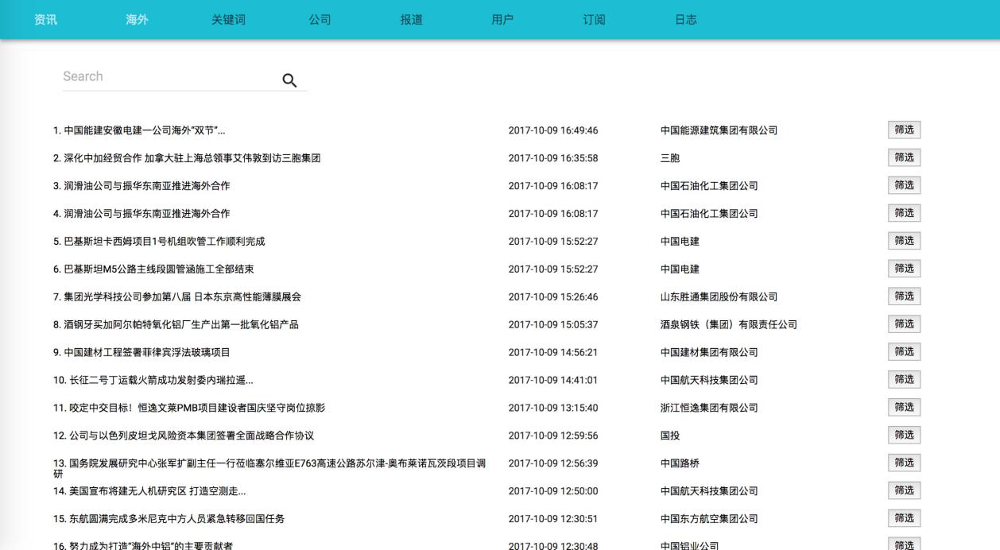

# 1 简介

   本项目基于Python开发，是一个专为气象内容定制的综合爬虫框架，爬取内容覆盖主流媒体，各大论坛及各类相关网络信息源。以气象领域内的关键字为基准，对网络数据进行内容筛选，存储有价值信息，并对其进行分析、整合、展示。通过对有用信息的爬取，实现对互联网海量信息的采集，并经过处理发现热点话题，同时对热点话题的发展趋势进行预测，进而帮助江西省气象局宣传管理部门实时监控网络传播动态，了解社会舆论对气象工作的关注热点，发现网络重大负面事件，并积极疏导网络负面信息。

# 2 运行环境

## 2.1硬件配置

    服务器：浪潮

    操作系统：Linux(Ubuntu 14.04)

    CPU：Intel 至强E5-2698 16核

    内存：64G

    硬盘：2T

    网络：100M双线接入

## 2.2软件

    Python（编程语言）

    Redis（消息队列）

    Mysql（数据库）

    Scrapy（爬虫框架）

    Celery（任务队列）

    Tornado（数据展示框架）

    ……

# 3 项目设计

## 3.1 技术方案

   本项目涉及到爬取的网站数目繁多，网页结构各异。而且诸如百度贴吧、新浪微博等网站有较强的反爬虫机制，过于频繁的抓取数据存在被封号或IP黑名单的风险，将会严重影响数据获取效果。对此，我们在设计时需要代理IP池以应对反爬虫机制，保证项目的正常进行。同时，单服务器长时间大规模的爬取数据，爬取速度及稳定性易受影响。出于性能考虑以及保证项目正常进行，我们设计时采用分布式架构。

## 3.2 内容筛选（关键字解析）

   本项目所需内容主要涉及气象领域。根据提供的气象领域的关键字（如气候、洪水、天气预报、空气污染及气象专有名词等）将爬取的内容筛选。出于数据量较大的考虑，我们需要设计合理地算法以平衡筛选性能与精确度。我们设计时考虑使用与搜索引擎相同地处理流程，将抓取数据汇总后先进行基础过滤、分词，将分词结果与关键字列表进行匹配，若命中则提取信息并存入数据库并在库中对每个词分别建立倒排索引以提高检索性能。

## 3.3 数据库

   由于项目将长期运行，数据存储随时间持续增长，我们需要设计合理的存储结构，以便后期数据处理分析以及可视化等流程正常进行。初步设计地存储结构以及表间关系如图1所示(实体关系模型图)。

## 3.4 内容展示(使用Tornado框架搭建展示页面）

   项目使用Tornado框架搭建展示页面, Tornado是一个使用非阻塞网络I/O的异步Web后端框架，可以支撑上万级的连接，并且Tornado开发简单易编写，作为一个轻量级，可拓展和部署能力都不错，适合承载项目的后台展示功能。

## 3.5 页面抓取流程

   爬虫框架中将各个功能模块区分开，方便实现子模块，进而便捷地扩展新消息源爬取能力。各个功能流程区分成Spider模块（主控），Downloader模块（下载器），PageProcesser模块（页面分析），Scheduler模块（任务队列），Storage模块(数据存储）， Analysis模块(统计分析),Pipeline模块（存储输出展示）等。框架结构图如下

##  3.6 整体设计框

   项目框架主要分为前端和后端两部分，后端包括爬虫和数据分析，主要涉及信息的筛选、有用信息的爬取、数据库存储，以及后期对信息的分析和整合。在控制器的监测下，爬虫程序在Worker队列中以多线程形式高效运行，爬取到的有用信息存入数据库，以待此后的分析与处理。前端是用户的操作界面，数据库中存储的信息显示与页面，便于用户查看气象信息。

## 3.7 数据展示

## 3.8 前台展示

    前台设计参照下图
　

# 4 项目进度规划

## 4.1第一阶段

    (1) 技术选型

    (2) 数据库设计

    (3) 初始框架结构搭建，

    (4) 实验性抓取，选取少量站点，少量数据进行抓取。

    (5) 搭建Demo页面

    预期时间：7个工作日

## 4.2 第二阶段

    (1) 流程优化

        优化项目各个模块间的衔接，完善辅助模块如调度，监控，日志等。保证大规模爬虫程序稳定运行。

    (2) 功能完善

        针对各类网站定制对应地解析规则，完成大部分站点爬虫程序编写。（部分反爬虫较强地网站除外）

    (3) 功能测试

        检测代码是否存在异常，保障数据在整个处理过程的安全性。

    (4) 数据分析/展示

        开发所需的数据展示和分析功能，如关键词检索，热点分析等。

    (5) 确定因技术限制暂时无法实现的功能

# 第三阶段

    (1) 交付测试

    (2) 文档交付

    (3) 联调&验收
